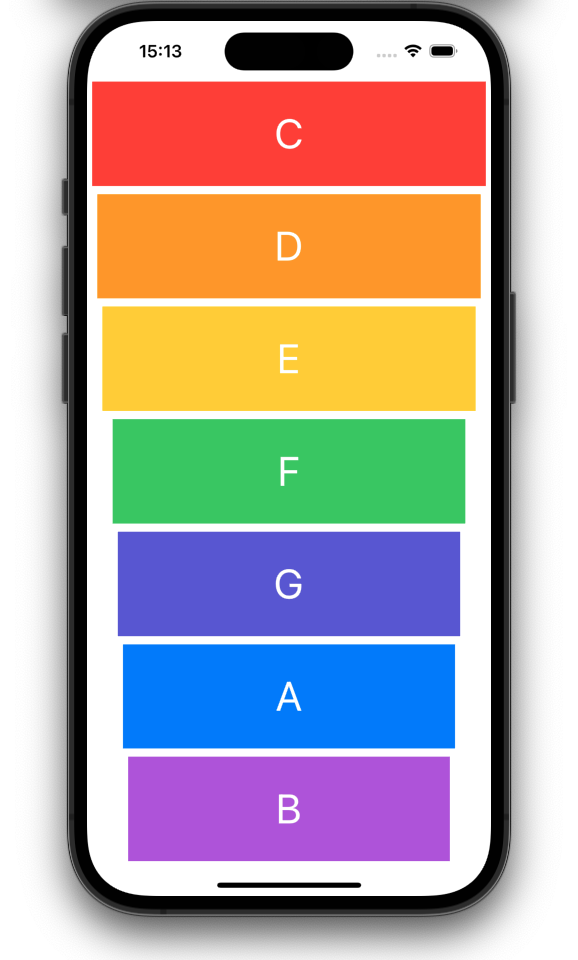

## Our Goal

To dive into a simple iOS recipe - how to play sound and use an Apple library called AVFoundation. The most important skill of a great programmer is being able to solve your own problems.

## What was created

My first musical instrument! Music apps are so popular on the App Store that they even get their own category. We made a colourful XyloPhone app.

## What I learn

- How to play sound using AVFoundation and AVAudioPlayer.
- Understand Apple documentation and how to use StackOverflow.
- Functions and methods in Swift.
- Data types.
- Swift loops.
- Variable scope.
- The ViewController lifecycle.
- Error handling in Swift.
- Code refactoring.
- Basic debugging.

> This is a project made from The App Brewery's Complete App Developement Bootcamp, check out at [www.appbrewery.co](https://www.appbrewery.co/)
